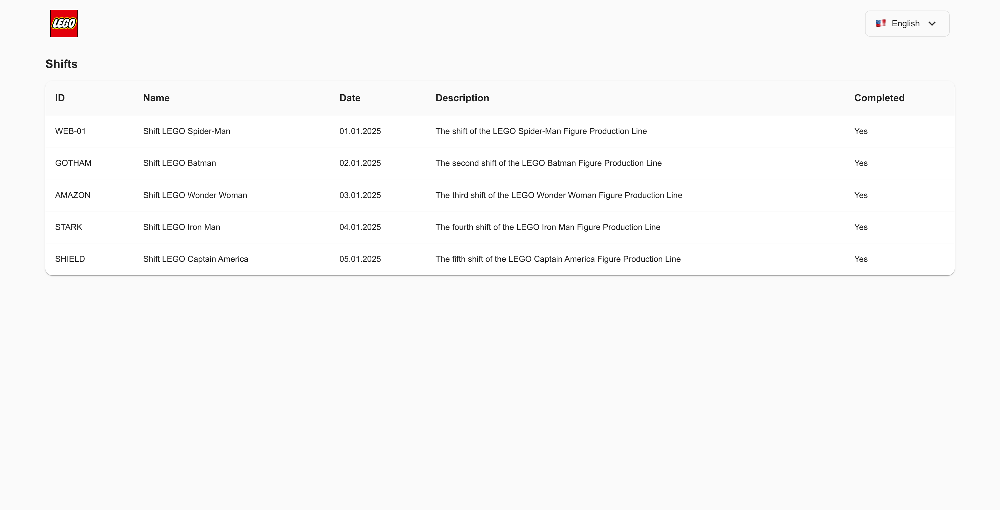
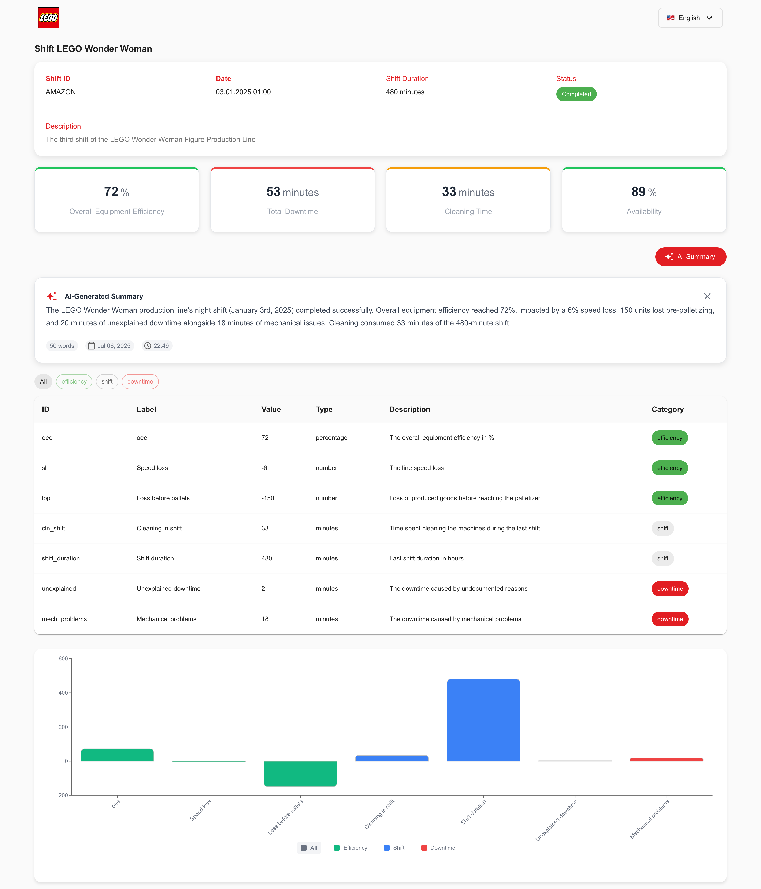
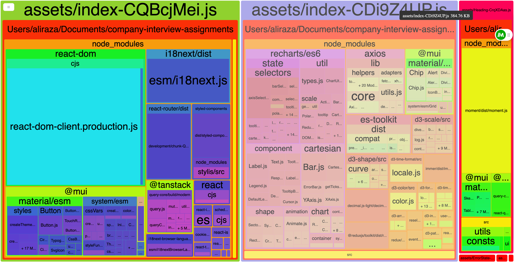
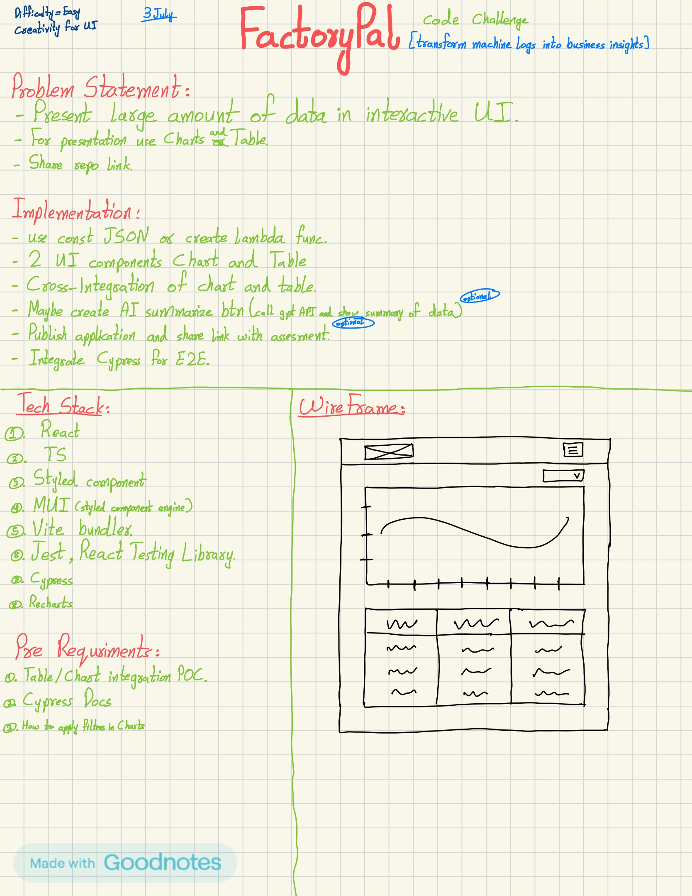

# FactoryPal - Interactive Factory Analytics Dashboard

[](https://reactjs.org/)
[](https://www.typescriptlang.org/)
[](https://vitejs.dev/)
[](https://mui.com/)

> **Transform machine logs into business insights** - A modern factory analytics dashboard built for the FactoryPal Code Challenge

## 🚀 Overview

FactoryPal is an interactive web application that transforms large amounts of factory data into meaningful business insights through a friendly and interactive UI. The application presents metrics data through interconnected charts and tables, specifically designed for LEGO action figure production lines.

### 📸 Screenshots

#### Home Dashboard

*Interactive dashboard showing shifts overview with filtering capabilities*

#### Shift Details

*Detailed shift analysis with metrics, charts, and AI-generated summaries*

#### Vite Bundle Analysis

*Bundle size analysis for performance optimization*

#### Development Notes

*Original wireframes and technical planning notes*

## 🎯 Challenge Requirements

**Problem Statement:**
- Present large amounts of data in an interactive UI
- Use charts and tables with cross-interactive relationships
- Transform machine logs into business insights

**Implementation Goals:**
- ✅ Interactive UI with charts and tables
- ✅ Cross-integration between chart and table components
- ✅ AI-powered data summarization
- ✅ Responsive design with modern UX
- ✅ Multi-language support (English/German)
- ✅ Comprehensive testing suite

## 🛠️ Tech Stack

### Core Technologies
- **React 19.1.0** - Modern React with latest features
- **TypeScript 5.8.3** - Type-safe development
- **Vite 7.0.0** - Fast build tool and dev server
- **Material-UI 7.2.0** - Modern component library
- **Styled Components 6.1.19** - CSS-in-JS styling

### Data & State Management
- **React Query (TanStack)** - Server state management
- **React Router DOM** - Client-side routing
- **React Error Boundary** - Error handling

### Visualization & UI
- **Recharts 3.0.2** - Modern charting library
- **Material-UI Icons** - Comprehensive icon set
- **Responsive Design** - Mobile-first approach

### Internationalization
- **i18next** - Translation framework
- **react-i18next** - React integration
- **Language Detection** - Automatic browser language detection

### Testing
- **Jest 30.0.4** - Unit testing framework
- **React Testing Library** - React component testing
- **Cypress 14.5.1** - End-to-end testing
- **Mochawesome** - Test reporting

### Development Tools
- **ESLint** - Code linting
- **Babel** - JavaScript transpilation
- **Vite Bundle Analyzer** - Bundle size analysis
- **Firebase** - Deployment platform

## 🏗️ Architecture & Approach

### Design Decisions

#### 1. **Component Structure**
```
src/
├── components/
│   ├── charts/          # Reusable chart components
│   ├── common/          # Shared UI components
│   ├── layout/          # Layout components
│   └── ui/              # Basic UI elements
├── hooks/               # Custom React hooks
├── services/            # API services
├── utils/               # Utility functions
└── types/               # TypeScript type definitions
```

#### 2. **Data Flow**
- **React Query** for server state management
- **Custom hooks** for business logic encapsulation
- **Context API** for global state (theme, language)
- **Props drilling** minimized through composition

#### 3. **Styling Strategy**
- **Styled Components** for component-specific styles
- **Material-UI (With styled compoent engine)** for consistent design system
- **Responsive breakpoints** for mobile-first design
- **Color constants** for brand consistency

#### 4. **Internationalization**
- **English & German** language support
- **Automatic language detection** from browser settings
- **Namespace organization** for scalable translations
- **Dynamic language switching** without page reload

### Key Features

#### 🔄 Interactive Data Visualization
- **Cross-Interactive Charts & Tables**: Filtering in one component affects the other
- **Multiple Chart Types**: Bar charts, line charts, pie charts
- **Real-time Updates**: Data refreshes automatically
- **Responsive Design**: Works on desktop, tablet, and mobile

#### 🤖 AI-Powered Insights
- **Automated Summaries**: AI generates shift summaries
- **Contextual Analysis**: Identifies trends and anomalies
- **Natural Language**: Technical data explained in plain English
- **Actionable Insights**: Recommendations for improvement

#### 🌐 Multi-Language Support
- **English & German** translations
- **Browser Detection**: Automatic language selection
- **RTL Support**: Ready for right-to-left languages
- **Extensible**: Easy to add new languages

#### 📊 Rich Data Presentation
- **Metric Cards**: Key performance indicators
- **Data Tables**: Sortable, filterable, paginated
- **Charts**: Interactive visualizations
- **Status Indicators**: Visual status representations

## 🚀 Getting Started

### Prerequisites
- Node.js 18.0.0 or higher
- npm or yarn package manager

### Installation

```bash
# Clone the repository
git clone [repository-url]
cd factory-pal

# Install dependencies
npm install

# Start development server
npm run dev
```

### Available Scripts

```bash
# Development
npm run dev          # Start development server
npm run build        # Build for production
npm run preview      # Preview production build

# Testing
npm run test         # Run unit tests
npm run test:watch   # Run tests in watch mode
npm run test:coverage # Run tests with coverage

# E2E Testing
npm run cy:open      # Open Cypress GUI
npm run cy:run       # Run Cypress tests
npm run cy:report:clean # Generate and open test report

# Deployment
npm run deploy       # Deploy to Firebase

# Maintenance
npm run clean        # Clean and reinstall dependencies
npm run lint         # Run ESLint
```

## 🧪 Testing Strategy

### Unit Testing (Jest + React Testing Library)
- **Component Testing**: All components have unit tests
- **Hook Testing**: Custom hooks are thoroughly tested
- **Utility Testing**: Helper functions are tested
- **Coverage Goal**: 80%+ test coverage

### E2E Testing (Cypress)
- **User Workflows**: Complete user journeys tested
- **Cross-browser Testing**: Multiple browser support
- **Visual Testing**: Screenshot comparison
- **API Testing**: Mock API responses

### Test Organization
```
__tests__/
├── components/      # Component tests
├── hooks/          # Hook tests
├── utils/          # Utility tests
└── integration/    # Integration tests

cypress/
├── e2e/            # End-to-end tests
├── fixtures/       # Test data
└── support/        # Test utilities
```

## 📈 Performance Optimizations

### Bundle Optimization
- **Code Splitting**: Routes and components are lazy-loaded
- **Tree Shaking**: Unused code is eliminated
- **Bundle Analysis**: Regular bundle size monitoring
- **Compression**: Gzip compression enabled

### Runtime Performance
- **React Query**: Intelligent caching and background updates
- **Memoization**: Expensive calculations are memoized
- **Virtualization**: Large lists are virtualized
- **Image Optimization**: Responsive images with lazy loading


## 🎨 Design System

### Typography
- **Headers**: Roboto, 400-700 weight
- **Body**: Roboto, 400-500 weight
- **Monospace**: 'Courier New', monospace

### Spacing
- **Base Unit**: 8px
- **Component Spacing**: 16px, 24px, 32px
- **Layout Spacing**: 40px, 64px, 80px

## 🚧 Assumptions Made

### Business Context
- **LEGO Production**: Themed around LEGO action figure production lines
- **Single Shift Data**: Each dataset represents one production shift
- **Multi-Language Requirement**: German and English support needed
- **Real-time Updates**: Data should refresh automatically after set time

### Technical Assumptions
- **Modern Browser Support**: ES6+ features used
- **Mobile-First**: Responsive design prioritized
- **Performance Critical**: Large datasets expected
- **Scalable Architecture**: Component reusability emphasized

## 🔮 Future Improvements

### Identified Areas for Enhancement

#### 1. **Bundle Size Optimization**
- **Remove Moment.js**: Replace with smaller date library (date-fns)
- **Tree Shaking**: Better elimination of unused Material-UI components
- **Code Splitting**: More granular component splitting

#### 2. **UX/UI Enhancements**
- **Color Scheme**: Research-based color palette
- **Animation**: Smooth transitions and micro-interactions
- **Accessibility**: WCAG 2.1 compliance improvements
- **Dark Mode**: Theme switching capability

#### 3. **Technical Debt**
- **Directory Structure**: More scalable organization
- **Component Composition**: Better component patterns
- **Error Handling**: More comprehensive error boundaries
- **Performance**: Additional optimization opportunities

#### 4. **Testing & Quality**
- **100% Test Coverage**: Comprehensive test suite
- **Visual Regression**: Automated visual testing
- **Performance Testing**: Load testing implementation
- **CI/CD Pipeline**: Automated deployment pipeline

#### 5. **Feature Additions**
- **Real-time Data**: WebSocket integration
- **Export Functionality**: PDF/Excel export
- **Advanced Filtering**: More sophisticated filter options
- **User Preferences**: Personalized dashboard settings

## 🤝 What Could Have Been Done Better

### Time Management
- **Feature Prioritization**: Could have focused on core features first
- **i18n Complexity**: International support added complexity
- **AI Summary**: Time-intensive feature that could have been deprioritized
- **Testing Coverage**: Could have achieved 100% coverage with better planning

### Technical Decisions
- **Moment.js**: Heavy library choice impacting bundle size
- **Component Structure**: Some components could be more modular
- **State Management**: Could have used Zustand for simpler state
- **CSS Strategy**: Mixed styling approaches could be more consistent

### Development Process
- **Research Phase**: More time on UX/UI research
- **Documentation**: Earlier documentation creation
- **Testing Strategy**: Test-driven development approach
- **Performance**: Earlier performance optimization

## 📚 Learning Outcomes

### Technical Skills
- **Modern React**: Latest React patterns and hooks
- **TypeScript**: Advanced type definitions and generics
- **Testing**: Comprehensive testing strategies
- **Performance**: Bundle optimization techniques
- **Internationalization**: Multi-language application development

### Soft Skills
- **Time Management**: Balancing features vs. time constraints
- **Decision Making**: Technical trade-offs and prioritization
- **Problem Solving**: Complex data visualization challenges
- **Communication**: Clear documentation and code organization

## 🏆 Achievements

### Requirements Met
- ✅ **Interactive UI**: Charts and tables with cross-interaction
- ✅ **React + TypeScript**: Modern development stack
- ✅ **Jest Testing**: Comprehensive unit test suite
- ✅ **Styled Components**: CSS-in-JS styling
- ✅ **Cypress E2E**: End-to-end testing implementation

### Bonus Features
- ✅ **AI Summaries**: Intelligent data summarization
- ✅ **Internationalization**: Multi-language support
- ✅ **Modern UX**: Beautiful and responsive design
- ✅ **Performance**: Optimized bundle and runtime
- ✅ **Documentation**: Comprehensive project documentation

## 🚀 Deployment

The application is deployed on Firebase Hosting and can be accessed at the provided URL during the interview.

### Build Process
```bash
# Production build
npm run build

# Deploy to Firebase
npm run deploy
```


*Built by Ali for the FactoryPal Code Challenge*
